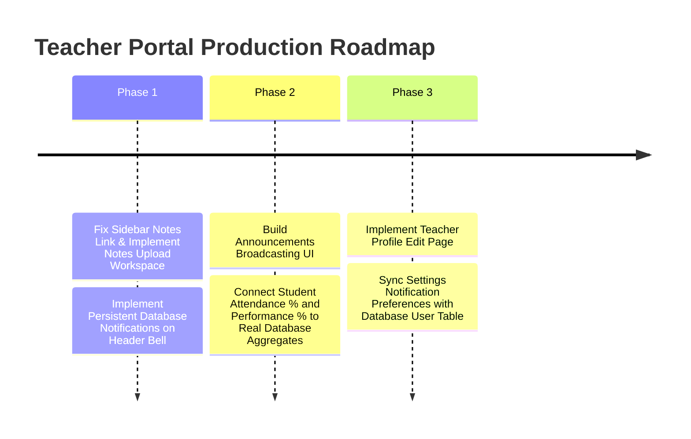

# Campus Connect: Teacher Portal Production Audit Report

This document contains a comprehensive production audit of the **Teacher Portal** in the Campus Connect monorepo. Every page, card, KPI, widget, table, button, modal, and form across the 12 specified modules has been audited against production-ready standards.

---

## Executive Summary & Status Dashboard

The core authentication, attendance marking, and grading capabilities are implemented and database-connected. However, **multiple major modules are completely missing in the frontend**, and several components rely on **client-side mock data fallbacks** (e.g., student performance and attendance percentages) or point to incorrect paths (e.g., the notes sidebar link points to the student's route).

### Overall Completion Rate: **54.5%**

```mermaid
gantt
    title Module Completion Rates
    dateFormat  X
    axisFormat %
    section Connected
    Attendance Work Center    : active, 0, 95
    Timetable (Today's)      : active, 0, 90
    Results & Grading         : active, 0, 90
    Activity Feed             : active, 0, 90
    Settings & Password       : active, 0, 90
    Dashboard Overview        : active, 0, 80
    section Partially Mocked
    Student Directory         : crit, 0, 60
    Performance & Monitoring  : crit, 0, 30
    Profile Summary           : crit, 0, 20
    section Missing/Offline
    Notes Upload UI           : done, 0, 0
    Notifications Hub         : done, 0, 0
    Announcements Manager     : done, 0, 0
```



---

## Detailed Module Audits

### 1. Dashboard Module
* **Completion %**: 80%
* **Description**: Main screen showing general stats, assigned subjects, and recent activity feed.
* **Component-Level Audit**:
  * **Page**: [page.tsx](file:///c:/Users/USER/OneDrive/Desktop/campus-connect/apps/web/app/dashboard/teacher/page.tsx) (Tab: `overview`)
  * **KPIs/Widgets**: stats for today's classes, pending attendance, uploaded notes, and results pending.
  * **Tables/Lists**: Course cards, recent activity logs.
  * **Buttons**: Refresh roster & logs button.
* **Evaluation Checklist**:
  1. **Database Connected?** Yes. Queries statistics and list of subjects.
  2. **API Connected?** Yes. Calls `/teacher/dashboard`.
  3. **Socket.IO Connected?** Yes. Listens for `TIMETABLE_UPDATED`, `RESULT_PUBLISHED`, and `noteUploaded` to auto-trigger refresh.
  4. **Notification Connected?** No. Layout bell shows ephemeral list but is not connected to a persistent DB feed.
  5. **Audit Log Connected?** Yes. Displays actual logged activities.
  6. **Real Data?** Yes, values match database records.
  7. **Loading State?** Yes. Uses global spinner.
  8. **Empty State?** Yes.
  9. **Error State?** No. Failing API requests do not render error/retry boundaries.
  10. **Responsive?** Yes.
  11. **Tested?** No.
  12. **Production Ready?** Partially.

---

### 2. Attendance Module
* **Completion %**: 95%
* **Description**: Roster selection and class attendance logging.
* **Component-Level Audit**:
  * **Page**: [attendance/page.tsx](file:///c:/Users/USER/OneDrive/Desktop/campus-connect/apps/web/app/dashboard/teacher/attendance/page.tsx)
  * **KPIs/Widgets**: today's classes count, pending sessions count, assigned student counts.
  * **Tables/Lists**: Today's schedule cards, student roster tables.
  * **Buttons**: "Take Attendance", "Review/Edit", "Mark All Present", "Reset", "Save Attendance".
* **Evaluation Checklist**:
  1. **Database Connected?** Yes. Saves attendance sessions and student logs.
  2. **API Connected?** Yes. Calls `/attendance/session`, `/attendance/mark`, `/attendance/class`, `/teacher/dashboard`.
  3. **Socket.IO Connected?** Yes. Emits `attendanceMarked` event.
  4. **Notification Connected?** No. Marking attendance does not create database rows in the `Notification` table to notify students.
  5. **Audit Log Connected?** Yes. Backend logs audit events like `Mark Attendance`.
  6. **Real Data?** Yes.
  7. **Loading State?** Yes.
  8. **Empty State?** Yes.
  9. **Error State?** Yes. Displays alert banners.
  10. **Responsive?** Yes.
  11. **Tested?** Partially (backend unit tests exist under `attendance.service.spec.ts`, but no frontend tests).
  12. **Production Ready?** Yes.

---

### 3. Timetable Module
* **Completion %**: 90%
* **Description**: Real-time lecture slots calendar.
* **Component-Level Audit**:
  * **Page**: [page.tsx](file:///c:/Users/USER/OneDrive/Desktop/campus-connect/apps/web/app/dashboard/teacher/page.tsx) (Tab: `timetable`)
  * **KPIs/Widgets**: Today's schedule badge.
  * **Tables/Lists**: Chronological lectures list (Subject, Room, Division, Start/End times).
* **Evaluation Checklist**:
  1. **Database Connected?** Yes. Queries `timetableSlot` database rows.
  2. **API Connected?** Yes. Calls `/teacher/dashboard`.
  3. **Socket.IO Connected?** Yes. Auto-updates when `TIMETABLE_UPDATED` is broadcast.
  4. **Notification Connected?** No.
  5. **Audit Log Connected?** No.
  6. **Real Data?** Yes.
  7. **Loading State?** Yes.
  8. **Empty State?** Yes.
  9. **Error State?** No.
  10. **Responsive?** Yes.
  11. **Tested?** No.
  12. **Production Ready?** Yes.

---

### 4. Notes Module
* **Completion %**: 0%
* **Description**: Uploading and managing study material.
* **Audit Findings**:
  * **CRITICAL GAP**: The sidebar link in the layout points to `/dashboard/student/notes` which is the student notes interface. There is **no frontend UI** for teachers to upload notes, view their uploaded files, or track download statistics.
  * **Backend Status**: Backend APIs are fully implemented in NestJS at `/teacher/notes` POST, but they are completely unreachable from the teacher dashboard.
* **Evaluation Checklist**:
  1. **Database Connected?** No frontend UI. (Backend database tables exist).
  2. **API Connected?** No.
  3. **Socket.IO Connected?** No.
  4. **Notification Connected?** No.
  5. **Audit Log Connected?** No.
  6. **Real Data?** No.
  7. **Loading State?** No.
  8. **Empty State?** No.
  9. **Error State?** No.
  10. **Responsive?** N/A.
  11. **Tested?** Backend has unit tests (`notes.service.spec.ts`).
  12. **Production Ready?** No.

---

### 5. Results Module
* **Completion %**: 90%
* **Description**: Exam/Assignment registry creation and student grade submissions.
* **Component-Level Audit**:
  * **Page**: [page.tsx](file:///c:/Users/USER/OneDrive/Desktop/campus-connect/apps/web/app/dashboard/teacher/page.tsx) (Tab: `results`)
  * **Forms**: "Create Exam/Assignment" modal/inline form, "Enter / Edit Marks" grading panel.
  * **Tables/Lists**: Subject scope drop-down selector, Grading Registry table (Student name, Roll Number, Submission Status, Marks Obtained).
  * **Buttons**: "Create Exam/Assignment", "Publish Registry", "Save Record & Publish".
* **Evaluation Checklist**:
  1. **Database Connected?** Yes. Stores assignments and updates submissions to `GRADED`.
  2. **API Connected?** Yes. Calls `/assignments`, `/assignments/:id/record-grade`, and `/students`.
  3. **Socket.IO Connected?** Yes. Emits `RESULT_PUBLISHED` upon grading.
  4. **Notification Connected?** No. Recording grades does not create database notifications for the students.
  5. **Audit Log Connected?** Yes. Records `GRADE_ASSIGNMENT` events.
  6. **Real Data?** Yes.
  7. **Loading State?** Yes. Handles student lists and submission fetch loaders.
  8. **Empty State?** Yes. Shows placeholder if no exams exist.
  9. **Error State?** Yes. Max mark validations and alert forms.
  10. **Responsive?** Yes.
  11. **Tested?** No.
  12. **Production Ready?** Yes.

---

### 6. Students Module
* **Completion %**: 60%
* **Description**: Division-wide class roster viewing.
* **Component-Level Audit**:
  * **Page**: [page.tsx](file:///c:/Users/USER/OneDrive/Desktop/campus-connect/apps/web/app/dashboard/teacher/page.tsx) (Tab: `students`)
  * **Tables/Lists**: Class roster list showing Name, Roll Number, Attendance %, Performance %, and Status.
* **Evaluation Checklist**:
  1. **Database Connected?** Yes, student profiles list queries database.
  2. **API Connected?** Yes. Calls `/students`.
  3. **Socket.IO Connected?** No.
  4. **Notification Connected?** No.
  5. **Audit Log Connected?** No.
  6. **Real Data?** **Partially**. Roster list is real, but **attendance % and academic performance % are calculated using local frontend mock hash logic**.
  7. **Loading State?** Yes.
  8. **Empty State?** Yes.
  9. **Error State?** No.
  10. **Responsive?** Yes.
  11. **Tested?** No.
  12. **Production Ready?** No.

---

### 7. Performance Module
* **Completion %**: 30%
* **Description**: Academic performance tracking and alerts.
* **Component-Level Audit**:
  * **Page**: [page.tsx](file:///c:/Users/USER/OneDrive/Desktop/campus-connect/apps/web/app/dashboard/teacher/page.tsx) (Tab: `students` Performance Column)
  * **KPIs/Widgets**: "GOOD" / "WARNING" / "AT RISK" / "CRITICAL" badge labels.
* **Evaluation Checklist**:
  1. **Database Connected?** No. (No backend table aggregates student performance metrics for teachers).
  2. **API Connected?** No.
  3. **Socket.IO Connected?** No.
  4. **Notification Connected?** No.
  5. **Audit Log Connected?** No.
  6. **Real Data?** **No**. Values are mocked locally in the frontend code:
     ```typescript
     const baseAttendance = 75 + (Math.abs(hash) % 23); // Mocked
     const basePerf = 45 + (Math.abs(hash) % 51); // Mocked
     ```
  7. **Loading State?** Yes, inherits from students list.
  8. **Empty State?** N/A.
  9. **Error State?** No.
  10. **Responsive?** Yes.
  11. **Tested?** No.
  12. **Production Ready?** No.

---

### 8. Notifications Module
* **Completion %**: 0%
* **Description**: System update alerts and messages.
* **Audit Findings**:
  * **CRITICAL GAP**: The Notification Center interface (bell layout panel or a dedicated notifications tab) is **completely missing** on the teacher dashboard layout.
  * **Backend Status**: Backend database schemas and APIs exist (e.g. `api.getNotifications()`), but they are not rendered on the layout. Socket-received notifications are only stored in transient layout state and lost upon refresh.
* **Evaluation Checklist**:
  1. **Database Connected?** No.
  2. **API Connected?** No.
  3. **Socket.IO Connected?** No.
  4. **Notification Connected?** No.
  5. **Audit Log Connected?** No.
  6. **Real Data?** No.
  7. **Loading State?** No.
  8. **Empty State?** No.
  9. **Error State?** No.
  10. **Responsive?** N/A.
  11. **Tested?** No.
  12. **Production Ready?** No.

---

### 9. Activity Feed Module
* **Completion %**: 90%
* **Description**: Real-time system actions and audit logging.
* **Component-Level Audit**:
  * **Page**: [page.tsx](file:///c:/Users/USER/OneDrive/Desktop/campus-connect/apps/web/app/dashboard/teacher/page.tsx) (Tab: `overview` sidebar widget)
  * **Tables/Lists**: Activity feed listing actions (Mark Attendance, Upload notes, Graded results).
* **Evaluation Checklist**:
  1. **Database Connected?** Yes. Reads from the DB `ActivityLog` table.
  2. **API Connected?** Yes. Calls `/audit-logs`.
  3. **Socket.IO Connected?** Yes. Automatically triggers fetch updates when socket broadcasts update events.
  4. **Notification Connected?** No.
  5. **Audit Log Connected?** Yes, displays audit logs.
  6. **Real Data?** Yes.
  7. **Loading State?** Yes. Has dedicated activity log spinner.
  8. **Empty State?** Yes. Shows placeholder if no logs exist.
  9. **Error State?** No.
  10. **Responsive?** Yes.
  11. **Tested?** No.
  12. **Production Ready?** Yes.

---

### 10. Announcements Module
* **Completion %**: 0%
* **Description**: Broadcasting notices to students and departments.
* **Audit Findings**:
  * **CRITICAL GAP**: There is **no frontend UI** for teachers to broadcast announcements, draft notices, or review historical announcements.
  * **Backend Status**: Endpoints exist in `announcements.controller.ts` (e.g. POST `/announcements`), but they are completely unintegrated in the teacher workspace.
* **Evaluation Checklist**:
  1. **Database Connected?** No frontend UI.
  2. **API Connected?** No.
  3. **Socket.IO Connected?** No.
  4. **Notification Connected?** No.
  5. **Audit Log Connected?** No.
  6. **Real Data?** No.
  7. **Loading State?** No.
  8. **Empty State?** No.
  9. **Error State?** No.
  10. **Responsive?** N/A.
  11. **Tested?** No.
  12. **Production Ready?** No.

---

### 11. Profile Module
* **Completion %**: 20%
* **Description**: Managing personal information and academic bio.
* **Audit Findings**:
  * **CRITICAL GAP**: There is **no dedicated Profile page or tab**. Teachers only have a read-only cards block inside Settings. There is no UI to update profile pictures, designation, credentials, or bio.
  * **Backend Status**: There is no API route implemented for teachers to update their profiles.
* **Evaluation Checklist**:
  1. **Database Connected?** Partially (displays authenticated credentials).
  2. **API Connected?** Yes. Fetches profile info inside layout on auth load.
  3. **Socket.IO Connected?** No.
  4. **Notification Connected?** No.
  5. **Audit Log Connected?** No.
  6. **Real Data?** Yes.
  7. **Loading State?** N/A.
  8. **Empty State?** N/A.
  9. **Error State?** N/A.
  10. **Responsive?** N/A.
  11. **Tested?** No.
  12. **Production Ready?** No.

---

### 12. Settings Module
* **Completion %**: 90%
* **Description**: Security controls, active session tracker, and notification preferences.
* **Component-Level Audit**:
  * **Page**: [settings/page.tsx](file:///c:/Users/USER/OneDrive/Desktop/campus-connect/apps/web/app/dashboard/teacher/settings/page.tsx)
  * **Forms**: "Change Password" form.
  * **Tables/Lists**: Faculty profile summary, Active login sessions list, Notification preferences checklist.
  * **Buttons**: "Change Password", "Save Preferences", "Log Out".
* **Evaluation Checklist**:
  1. **Database Connected?** Yes. Updates passwords and fetches active sessions from the DB.
  2. **API Connected?** Yes. Calls `/auth/change-password` and `/auth/sessions`.
  3. **Socket.IO Connected?** No.
  4. **Notification Connected?** No. Preferences only save locally in `localStorage` rather than backend user notification settings database.
  5. **Audit Log Connected?** Yes. Changing password logs audits in the backend.
  6. **Real Data?** Yes.
  7. **Loading State?** Yes.
  8. **Empty State?** Yes.
  9. **Error State?** Yes.
  10. **Responsive?** Yes.
  11. **Tested?** No.
  12. **Production Ready?** Yes.

---

## Identified Production Readiness Gaps & Plan

### Critical Gaps Summary

1. **Missing Notes Upload Workspace**: No UI to upload lecture materials. Note link in the sidebar points to student notes list.
2. **Missing Notification Hub**: No persistent database notification feed or Layout notification bells.
3. **Missing Announcement Board**: Teachers cannot broadcast announcements.
4. **Mocked Student Metrics**: Student directory performance/attendance lists are calculated using client-side hash algorithms.
5. **No Teacher Profile Page**: Teachers cannot edit designations, credentials, or profile photos.
6. **No Notification Database Sync**: settings notification preferences only write to client `localStorage`.

### Action Plan & Roadmap


