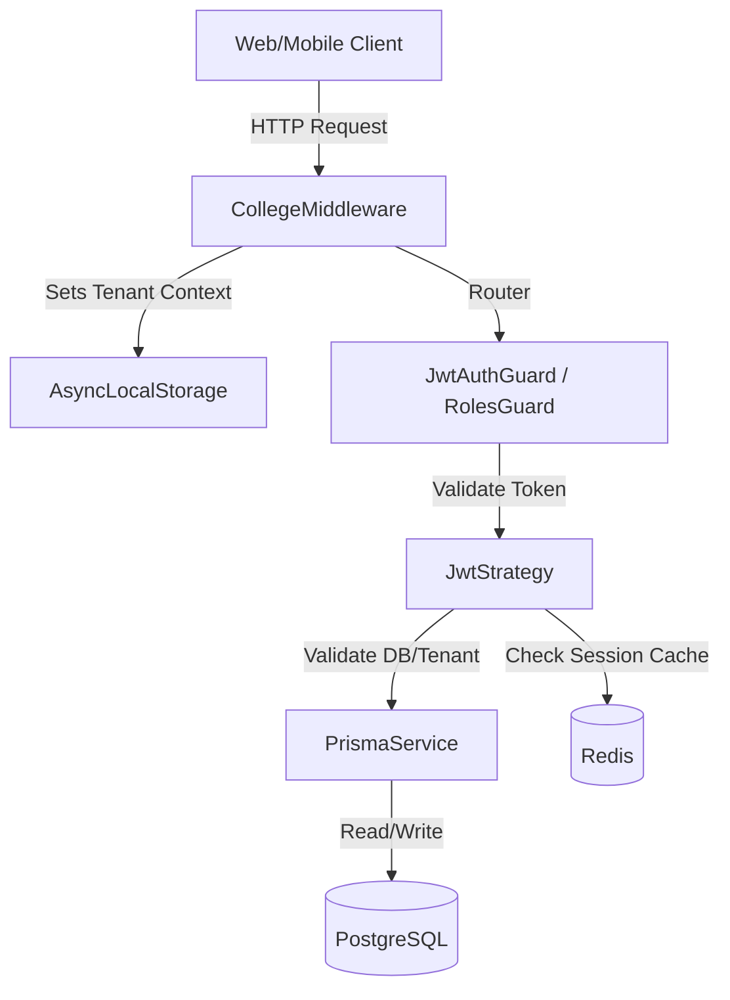

# Authentication Audit - Campus Connect

This document outlines the findings of the Day 1 audit of the Authentication & Identity System in Campus Connect.

---

## 1. Authentication Architecture Overview

The system is built on NestJS using **Passport.js** and **JWT** for session orchestration, backed by **Prisma (PostgreSQL)** for persistence and **Redis** for rate-limiting, session state caching, and temporary OTP storage.



---

## 2. Main Authentication Flows

### A. Local Email & Password Login Flow
1. **Request Reception:** Client hits `POST /api/v1/auth/login` with `LoginDto` (email, password).
2. **reCAPTCHA Check:** Verified if in a production context (or token is not mocked).
3. **Rate Limiting:** Redis rate limits by IP and email.
4. **User Lookup:** User queried by email.
   - If not found, throws a generic `AUTH_001` (Invalid credentials) exception.
5. **Account Checks:** Ensures user is not locked (`lockedUntil`) and status is `ACTIVE` (e.g. not `PENDING_VERIFICATION`).
6. **Password Verification:** Password verified using `bcrypt.compareSync` against the stored `passwordHash`.
   - If mismatch, increments failed attempts, handles lockout duration (15m after 5 failures, 1hr after 10 failures, suspension after 20 failures), and throws `AUTH_001`.
7. **Workspace & Role Mapping:**
   - **Multi-Role User:** Returns `needsWorkspaceSelection: true` and a short-lived 5-minute temporary selection token (`tempToken`). User selects role via `POST /api/v1/auth/select-role`.
   - **Single-Role User:** Passes directly to token generation.
8. **Session Creation:** Creates a `RefreshToken` record and a `Session` record in PostgreSQL, caches payload in Redis, and signs the Access (30-min) and Refresh (7-day) tokens.

### B. Google OAuth Login Flow
1. **Request Reception:** Client hits `POST /api/v1/auth/google` with `GoogleLoginDto` (Google ID token, selected `collegeId`, selected `role`).
2. **Token Verification:** Validates Google ID token against `https://oauth2.googleapis.com/tokeninfo`.
3. **Registration Check:**
   - If the user does not exist in the database and the requested role is `STUDENT`, they are **dynamically registered** in a database transaction (creating `User`, `Student`, `StudentProfile`, and mapping them to a default division).
   - If the user does not exist and the role is not `STUDENT`, throws an `UnauthorizedException`.
4. **Tenant & Role Check:** Asserts that the existing user matches the selected `collegeId` and has the selected `role`.
5. **Session Creation:** Creates active database sessions, updates Redis session cache, and signs standard access/refresh tokens.

---

## 3. JWT Structure & Claims

Tokens are signed using a HS256 secret (`process.env.JWT_SECRET`).

### A. Access Token
- **Lifetime:** 30 minutes.
- **Payload Structure:**
  ```json
  {
    "sub": "usr-uuid-string",
    "email": "user@domain.com",
    "role": "STUDENT",
    "sessionId": "refresh-token-uuid-string",
    "collegeId": "college-a-uuid",
    "iat": 1721054000,
    "exp": 1721055800
  }
  ```

### B. Refresh Token
- **Lifetime:** 7 days.
- **Payload Structure:**
  ```json
  {
    "sub": "usr-uuid-string",
    "sessionId": "refresh-token-uuid-string",
    "role": "STUDENT",
    "collegeId": "college-a-uuid",
    "iat": 1721054000,
    "exp": 1721658800
  }
  ```

---

## 4. Multi-Tenant Validation Model

Multi-tenancy isolation is enforced at three levels:
1. **`CollegeMiddleware`:** Runs on all incoming HTTP requests. It grabs `collegeId` from the `x-college-id` header or decodes it from the Bearer Token. It binds this context to `AsyncLocalStorage` (`collegeStorage`).
2. **`JwtStrategy`:** Validates that the active token's `collegeId` matches the active request's `collegeId` context.
3. **`PrismaService`:** Checks the context from `collegeStorage` to run automatic query scopes, ensuring that data queries don't leak records from other colleges.

---

## 5. Redis Integration Analysis

Redis is managed via [redis.service.ts](file:///c:/Users/USER/OneDrive/Desktop/campus-connect/apps/api/src/redis/redis.service.ts):
- **Rate-Limiting Keys:** `rate-limit:login:email:<lowercase_email>` and `rate-limit:login:ip:<client_ip>`.
- **Session Keys:** `session:<userId>:<sessionId>` caches active session structures for fast API lookup.
- **OTP Storage:** `otp:<lowercase_email>` houses hashed OTPs with a 5-minute TTL.

---

## 6. Identified Gaps & Stabilization Priorities

1. **Self-Registration Constraint:** Currently, student self-registration has fallbacks for division mapping (`div-a` / `div-b`) which can be brittle if database seeds differ. We need to ensure dynamic mapping checks are highly robust.
2. **Google ID Verification Network Failures:** A network blip when calling googleapis.com might break Google Logins. We need caching or soft timeouts.
3. **Session Cache Sync:** On password updates or user suspensions, cache entries in Redis must be immediately purged. Currently, `changePassword` does not invalidate the Redis cache session entries; it relies on next-access validation or expiration.
4. **Tenant Mismatch Error Codes:** The front-end expects clear messages. Tenant mismatches should be handled with clean warning flags rather than generic 500 errors.
