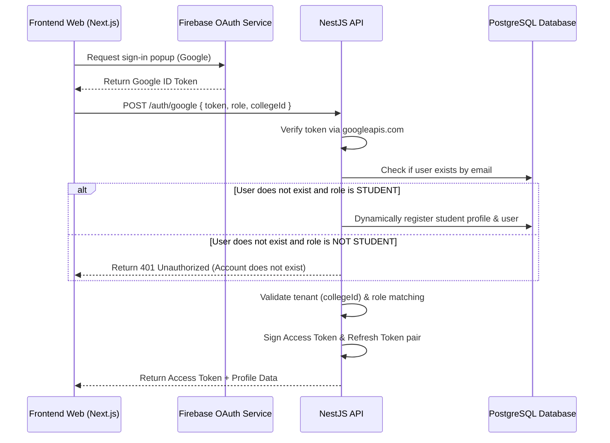

# Google Authentication & Firebase Integration

Campus Connect supports unified single-sign-on (SSO) authentication using Google Sign-In, orchestrated via **Firebase Authentication** on the client-side and verified using standard ID token validation on the backend API.

---

## 1. Authentication Flow



---

## 2. Firebase Frontend Configuration

The client app instantiates Firebase with the following configuration:

```typescript
import { initializeApp } from 'firebase/app';
import { getAuth, GoogleAuthProvider, signInWithPopup } from 'firebase/auth';

const firebaseConfig = {
  apiKey: process.env.NEXT_PUBLIC_FIREBASE_API_KEY,
  authDomain: process.env.NEXT_PUBLIC_FIREBASE_AUTH_DOMAIN,
  projectId: process.env.NEXT_PUBLIC_FIREBASE_PROJECT_ID,
  storageBucket: process.env.NEXT_PUBLIC_FIREBASE_STORAGE_BUCKET,
  messagingSenderId: process.env.NEXT_PUBLIC_FIREBASE_MESSAGING_SENDER_ID,
  appId: process.env.NEXT_PUBLIC_FIREBASE_APP_ID,
};

const app = initializeApp(firebaseConfig);
export const auth = getAuth(app);
export const googleProvider = new GoogleAuthProvider();
```

---

## 3. Allowed Domain Configurations

To prevent unauthorized domains from initiating logins, the Google OAuth client credentials and Firebase Console must restrict authorized domains.

### Authorized Domains (Firebase Auth Console)
- `localhost` (Development)
- `campus-connect.vercel.app` (Production)
- `campus-connect-*.vercel.app` (Wildcard wildcard for Vercel preview environments)

### Redirect URIs (Google Cloud Console OAuth Client)
- `https://campus-connect.firebaseapp.com/__/auth/handler`

---

## 4. Backend ID Token Verification

The NestJS backend verifies the integrity of the token passed by the frontend by querying the Google API tokeninfo endpoint:

```typescript
async verifyGoogleToken(token: string): Promise<{ email: string; name?: string; picture?: string }> {
  // Local development / mock token bypass
  if (token.startsWith('mock-google-token-')) {
    const email = token.replace('mock-google-token-', '');
    return { email, name: 'Google User' };
  }

  try {
    const response = await fetch(`https://oauth2.googleapis.com/tokeninfo?id_token=${token}`);
    if (response.ok) {
      const payload = await response.json();
      if (payload.email) {
        return {
          email: payload.email,
          name: payload.name,
          picture: payload.picture,
        };
      }
    }
  } catch (err) {
    // Log connection issue or timeout
  }

  throw new UnauthorizedException('Invalid Google ID Token');
}
```

---

## 5. Security & Account Duplicate Prevention

1. **Explicit Role & Tenant Requirements:** When logging in via Google, the request must include the intended `collegeId` and `role`. The backend verifies that the Google email belongs to that tenant and has that role.
2. **Dynamic Student Registration:** If a Google login attempt with `role: STUDENT` is received and the user does not exist:
   - The backend runs a database transaction creating a `User` with `status: ACTIVE`, maps them to the `STUDENT` role, and creates a default student profile linked to the college's first division.
3. **No Automatic Password Creation:** Dynamically created accounts are assigned a random password hash. Since they authenticate via Google OAuth, they do not require local credentials unless they trigger a password reset.
4. **Tenant Mismatch Rejection:** If a Google user from College A attempts to select College B tenant, the login is rejected with a `401 Unauthorized` exception (Error Code: `AUTH_008`), preventing cross-tenant access.
