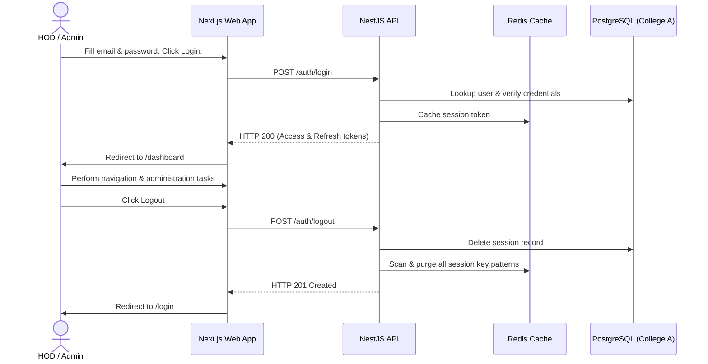

# HOD Acceptance Test Journey

This document describes the validation flow and execution results of the HOD Acceptance Test journey for Campus Connect.

---

## 1. HOD / Admin Credentials

The test suite seeds a dedicated HOD account mapped to the **College A** database:

- **Email:** `admin@collegea.com`
- **Password:** `password123`
- **Role:** `ADMIN`
- **Tenant ID:** `college-a`

---

## 2. Acceptance Flow Steps



1. **Login Phase:** The HOD logs in using their credentials. The request is processed by College A. The backend formats and prints the validation statuses in the terminal and returns active tokens.
2. **Dashboard Navigation:** The HOD successfully lands on the `/dashboard` page. Because their token contains the `ADMIN` role, the route guard permits access.
3. **Session Revocation (Logout):** The HOD logs out. The backend invalidates the JWT tokens in the Postgres DB and immediately scans and deletes matching keys from Redis. Any attempt to reuse the logged-out tokens is rejected with `401 Unauthorized`.

---

## 3. Playwright E2E Verification

The Playwright test suite automates this journey as part of acceptance checks.

### Run Acceptance Tests
To execute the automated Playwright tests verifying the device compatibility and HOD journey, execute:

```bash
pnpm --filter @campus-connect/web exec playwright test e2e/acceptance.spec.ts
```
