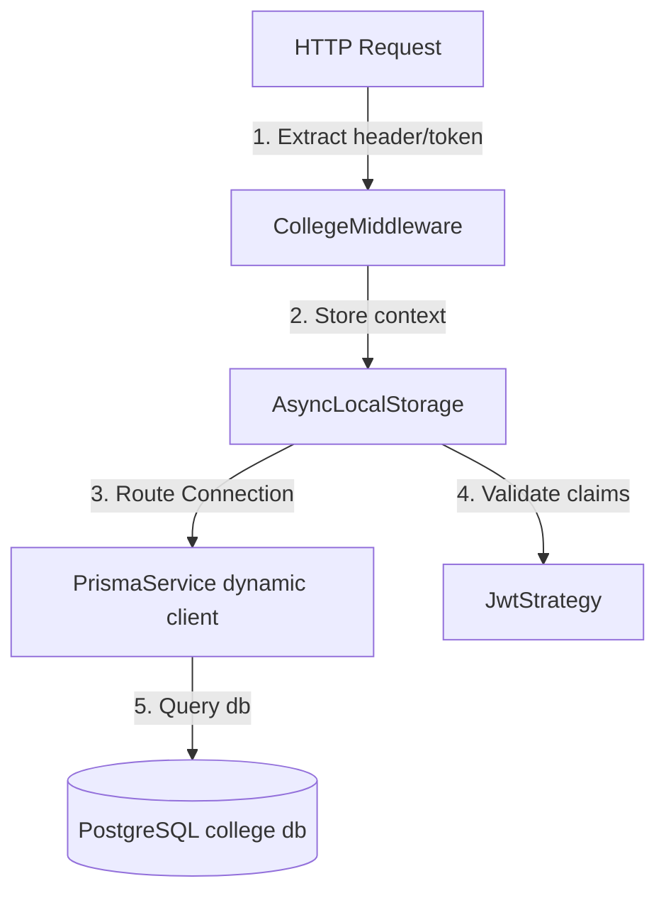

# Multi-Tenant Architecture & Isolation

Campus Connect is a multi-tenant ERP system supporting multiple colleges concurrently. It isolates data and route execution boundaries through a multi-layered verification strategy.

---

## 1. Multi-Tenant Verification Layers

Tenant isolation is enforced dynamically at three levels on every API request:

### A. HTTP Request & Context Binding (`CollegeMiddleware`)
- Intercepts all incoming API requests.
- Extracts `collegeId` from the `x-college-id` header or decodes it from the Bearer Token.
- Binds this `collegeId` context to Node.js `AsyncLocalStorage` (`collegeStorage`), which is queryable within any execution call stack downstream in the current asynchronous chain.

### B. Route-Level Token Verification (`JwtStrategy`)
- Checks if the authenticated user's `collegeId` claims inside their signed JWT match the active request context `collegeId` bound in `collegeStorage`.
- If a tenant mismatch is detected, throws a `403 Forbidden` exception, blocking execution before any controller route handler is called.

### C. Database Connection Routing (`PrismaService`)
- We run a proxy-wrapped dynamic connection manager.
- Instead of using a single global database instance, `PrismaService` selects the matching database client connection URL (`COLLEGE_A_DATABASE_URL`, `COLLEGE_B_DATABASE_URL`, or `COLLEGE_C_DATABASE_URL`) from the environment by querying the active `collegeId` from `collegeStorage`.
- Ensures that query executions are physically routed to the correct database instance.

---

## 2. Multi-Tenant Security Rules

- **No Shared Databases:** Each college's data resides in its own isolated Render PostgreSQL database instance.
- **Header Enforcement:** Requests targeting public endpoints (like `/login` or `/google`) must explicitly set the `x-college-id` header to resolve the target database.
- **Cross-Tenant Attack Detection:** If a student from College A manually sends an HTTP request with `x-college-id: college-b` using their signed College A token, the `JwtStrategy` intercepts and rejects the request with a `403 Forbidden` response.
