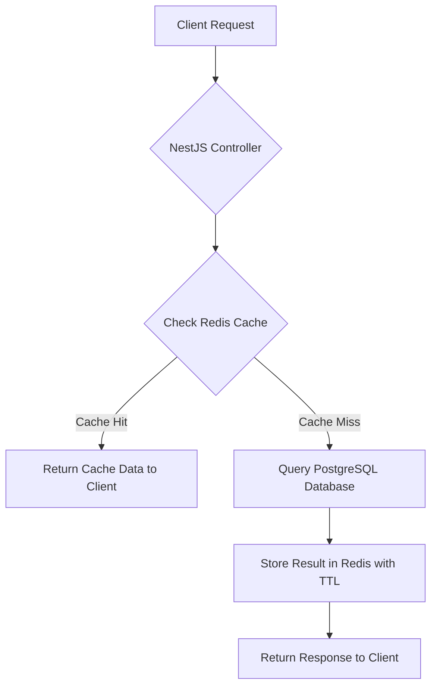
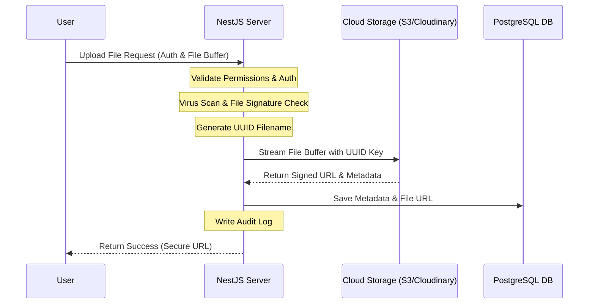
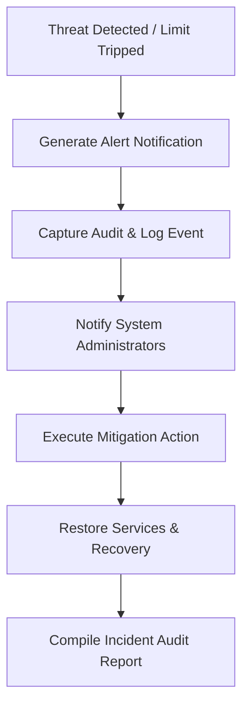
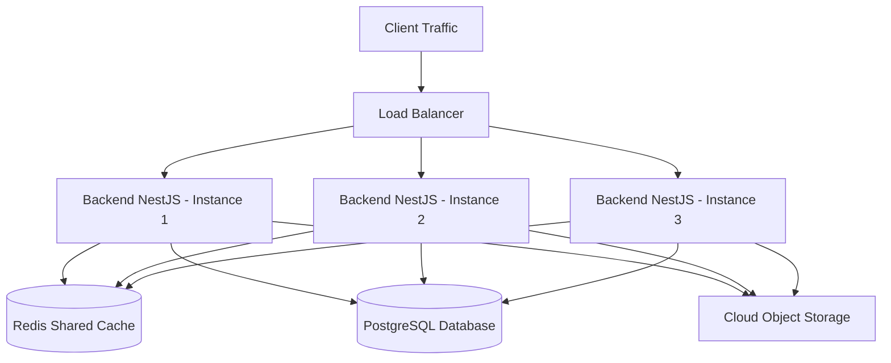

# Campus Connect Caching & Cloud Storage Architecture

**Version**: 1.0  
**Caching & Media Storage Architecture Standards**

---

## 1. Redis Caching Architecture

### 1.1 Objective
Redis is utilized to improve application performance, reduce PostgreSQL database load, and support real-time functionality. It acts as an ephemeral, high-throughput caching and storage layer for frequently accessed, temporary data.

### 1.2 Redis Responsibilities
The NestJS application utilizes Redis for the following modules and operations:

```
[Authentication] ➔ [Sessions] ➔ [Refresh Tokens] ➔ [API Cache] ➔ [Dashboard Cache] ➔ [Leaderboard Cache] ➔ [Notifications Queue] ➔ [Socket Sessions] ➔ [Rate Limiter] ➔ [OTP Storage]
```

*   **Sessions & Refresh Tokens**: Fast verification of user credentials and active token validation.
*   **API & Dashboard Cache**: Temporary storage of query responses for complex data aggregations.
*   **Leaderboard Cache**: Low-latency storage of performance indices and rankings.
*   **Notifications Queue**: Background job execution queue for event and announcement triggers.
*   **Socket Sessions**: Shared store for Socket.IO clients to support cluster scaling.
*   **Rate Limiter**: Sliding-window counter storage to prevent brute-force attacks and API abuse.
*   **OTP Storage**: Fast validation and verification codes for user actions.

---

### 1.3 Caching Flow & Fallback Strategy

The application executes a cache-aside (lazy-loading) strategy for reading data:



1.  **Read request** lands on the NestJS API.
2.  NestJS checks if the key exists in **Redis**.
3.  If a **Cache Hit** occurs, the serialised data is returned immediately.
4.  If a **Cache Miss** occurs:
    *   Query is sent to **PostgreSQL**.
    *   The result is serialized and stored in **Redis** with the specified TTL.
    *   The response is returned to the client.

---

### 1.4 Cache TTL Strategy

Cache expiration is tailored to the volatility of the source data:

| Cache Category | Target Cache Entity | TTL Duration | Invalidation Type |
| :--- | :--- | :--- | :--- |
| **Student Dashboard** | Dashboard metrics, schedule overview | 5 Minutes | Event-driven or Timeout |
| **Teacher Dashboard** | Workload stats, today's schedule | 5 Minutes | Event-driven or Timeout |
| **Admin Dashboard** | Tenant logs, global metrics | 2 Minutes | Event-driven or Timeout |
| **Leaderboard** | Performance metrics, active student ranks | 10 Minutes | Timeout |
| **Attendance Analytics** | Percentages, analytics graphs | 15 Minutes | Event-driven or Timeout |

---

### 1.5 Ephemeral Storage Structures

#### 1.5.1 Session Storage
Session information is stored in Redis to bypass database lookups on every incoming request.
*   **Key Format**: `session:{userId}:{sessionId}`
*   **Stored Attributes**:
    ```json
    {
      "jwt_session_id": "UUID",
      "refresh_token_hash": "SHA-256 string",
      "login_device": {
        "browser": "string",
        "os": "string",
        "device_type": "string"
      },
      "last_activity": "ISO-8601 Timestamp",
      "ip_address": "string"
    }
    ```

#### 1.5.2 OTP Storage
One-Time Passwords (OTPs) are stored hashed in Redis to prevent credential leaks.
*   **Key Format**: `otp:{email_or_phone}`
*   **TTL**: 5 Minutes (Strict expiration)
*   **Stored Attributes**:
    ```json
    {
      "otp_hash": "bcrypt/argon2 hash",
      "attempts": 0,
      "purpose": "PASSWORD_RESET | VERIFICATION"
    }
    ```

---

### 1.6 Rate Limiter Strategy
To safeguard the system, rate limits are managed in Redis with sliding-window counts:

*   **Login Endpoints**: `5 Requests` per **1 Minute** (Keys: `ratelimit:login:{ip}`)
*   **General API Endpoints**: `100 Requests` per **1 Minute** (Keys: `ratelimit:api:{userId_or_ip}`)
*   **Password Reset Request**: `3 Requests` per **1 Hour** (Keys: `ratelimit:pwreset:{email_or_ip}`)

---

### 1.7 Cache Invalidation Events
Redis cache invalidation is automated via event emitters (`@nestjs/event-emitter`). The cache is cleared immediately when the following entities are updated:

```
[Attendance Updated] ➔ Clears [Attendance Analytics Cache]
[Assignment Submitted] ➔ Clears [Student/Teacher Dashboard Cache]
[New Note Uploaded] ➔ Clears [Student Dashboard Cache]
[Student Added] ➔ Clears [Admin Dashboard Cache]
[Teacher Added] ➔ Clears [Admin Dashboard Cache]
[Event Published] ➔ Clears [All Dashboard Caches]
[Announcement Published] ➔ Clears [All Dashboard Caches]
```

---

### 1.8 Redis Monitoring & High Availability

#### 1.8.1 Monitoring Metrics
The following parameters must be tracked by application performance monitors (APM):
*   **Memory Usage**: Monitor for memory leaks and memory fragmentation ratios.
*   **Connected Clients**: Active TCP socket count.
*   **Evictions / Expired Keys**: Track eviction frequency to verify if `maxmemory` settings are properly dimensioned.
*   **CPU Utilization**: Ensure Redis processing remains non-blocking.
*   **Hit/Miss Ratio**: Maintain target caching efficiency (aim for > 70% hit ratio).

#### 1.8.2 High Availability (HA)
As the workload grows, the infrastructure will scale from a single standalone node to:
1.  **Redis Sentinel**: For automatic failover and master-replica node promotion.
2.  **Redis Cluster**: For data sharding across multiple nodes.

#### 1.8.3 Security Guidelines
*   **Password Protected**: `requirepass` enabled on all environments.
*   **Private Network**: Redis must only accept traffic from the internal VPC (NestJS instances). No public binding (`127.0.0.1` or VPC private IP only).
*   **Encrypted Connection**: Enable TLS for transit encryption between NestJS and Redis in staging and production.

---

## 2. Cloud Storage & CDN Architecture

### 2.1 Objective
Ensure all user-uploaded media is stored securely off the main application servers. The application instances should never store uploaded files on local disks permanently.

### 2.2 Providers & Failovers
*   **Primary**: **Cloudinary** (Optimized for quick rendering, image processing, and profile photos).
*   **Enterprise fallback / File Storage**: **AWS S3** (Used for backups, student documents, large assignments, and reports).
*   **Future Platforms**: Built-in adapter interfaces to allow moving to Google Cloud Storage or Azure Blob Storage.

---

### 2.3 Directory & Folder Structure

Uploaded files are logically separated by namespace:

```
campus-connect-bucket/
├── students/             # Profile photos, academic documents
├── teachers/             # Profile photos, resume files
├── notes/                # Faculty notes, study materials
├── assignments/          # Homework questions, resources
├── submissions/          # Student homework submissions
├── events/               # Event posters, banners
├── announcements/        # Announcement enclosures
├── reports/              # Generated reports, analytics sheets
├── certificates/        # Degree, merit certificate templates
└── backups/              # Encrypted database backups
```

---

### 2.4 Upload Pipeline



1.  **Auth & Permission Validation**: Verify the user has the permissions to upload to the specific directory (e.g. only teachers can upload to `/notes`).
2.  **Security Checks**: Perform extension validation, MIME type checks, and virus/malware scanning.
3.  **Generate UUID**: Replace original file names with random UUID names to prevent path traversal and collision.
4.  **Upload Storage**: Stream file directly to Cloud Storage.
5.  **URL Generation**: Retrieve secure, absolute URLs (or signed URLs for private files).
6.  **Save Metadata**: Save file size, checksum, upload path, and MIME type to database.
7.  **Audit Log**: Write upload event tracking to `audit_logs`.

---

### 2.5 Access Policies & CDN

#### 2.5.1 Public Files (CDN Served)
Files that are public or frequently requested are cached via CDN (Cloudflare or AWS CloudFront) to reduce download latency:
*   *Types*: Profile photos, notes, event banners, and announcement posters.
*   *Caching*: Cached at edge nodes for 30 days.

#### 2.5.2 Private Files (Signed URLs)
Files containing sensitive student details, grades, or administrative reports are strictly private:
*   *Types*: Assignments, student submissions, generated reports, degree certificates, and database backups.
*   *Access*: Accessed via HMAC-signed URLs with a maximum expiry time of **15 minutes**.

---

### 2.6 File Versioning & Retention
*   **Versioning**: Cloud Storage versioning is enabled on the S3 bucket. Modifying an existing file automatically creates a new version (e.g., `v1`, `v2`, `v3`) to ensure auditing capabilities.
*   **Cleanup Cron Job**: A NestJS background task checks for files in temporary directories or files marked as "unused" (uploaded files without mapping metadata in database) and purges them after 24 hours.
*   **Storage Monitoring**: Weekly checks monitor total bucket storage, monthly bandwidth limits, download volumes, and storage growth patterns.

---

## 3. Production Security Architecture

### 3.1 Objective
Establish strict security controls to protect the Campus Connect platform against common OWASP attacks, unauthorized data access, and infrastructure vulnerabilities.

### 3.2 Authentication & Account Protection
*   **Password Hashing**: Cryptographically secure hashes are generated using the **Argon2** algorithm. Standard plain-text or single-MD5/SHA storage is strictly prohibited.
*   **Session Management**: JSON Web Tokens (JWT) are verified for API access. Refresh tokens are tracked and hashed inside Redis to allow session auditing and remote sign-out.
*   **Failed Logins Lockout**: Lock user accounts for 15 minutes after 5 consecutive failed authentication attempts.
*   **Multi-Device Tracking**: Track active device metadata (OS, IP, Browser) in Redis. Validate OTP verification for any password resets or security setting changes.

### 3.3 API & Network Security
*   **Transport Layer Security**: Force HTTPS/TLS for all incoming traffic.
*   **Security Headers**: Integrate **Helmet** middleware to configure CSP (Content Security Policy), HSTS (HTTP Strict Transport Security), XSS filters, and Frame Options.
*   **CORS Policies**: Explicitly whitelist verified origin domains. Wildcard origin permissions (`*`) are disallowed.
*   **Rate Limiting**: Enforced via global NestJS throttler guard linked to Redis to prevent API abuse.
*   **Input Validation**: Use NestJS `ValidationPipe` with Zod/class-validator to enforce strict type checking and sanitize inputs.

### 3.4 Data & File Security
*   **Private Database/Redis**: Ensure PostgreSQL and Redis run on a private VPC network. They do not expose public ports to the internet.
*   **Parameterized Queries**: Relational database queries are parsed through Prisma ORM to ensure all queries are fully parameterized, preventing SQL Injection.
*   **File Upload Filter**: Uploaded files undergo MIME type verification, size checks, and malware scans. Executable formats (e.g. `.exe`, `.bat`, `.apk`) and raw scripts (e.g. `.js`, `.py`) are rejected.

### 3.5 Role-Based Access Control (RBAC)
A hierarchical role and permission validation guard secures every controller route:

```
[Incoming API Request] ➔ [Authentication Guard] ➔ [Role Guard] ➔ [Permission Guard] ➔ [College Scope Tenant Filter]
```

*   **Roles**: `STUDENT`, `TEACHER`, `COLLEGE_ADMIN`.
*   **Validation Check**: The application validates whether the user contains the target role, holds the specific action permission (e.g. `notes:delete`), and acts within their own tenant scope (`college_id`).

### 3.6 Secrets Management
All credentials (database string, API keys, tokens, JWT secrets, storage passwords) must be stored in encrypted environmental keychains (e.g. AWS Secrets Manager). Hardcoding secrets, committing credentials to Git, or writing sensitive tokens to log files is strictly forbidden.

### 3.7 Incident Response Workflow



1.  **Detection**: Intrusion detector or error alert limit is tripped (e.g. account lock, brute force block).
2.  **Alert**: Automatic system notification is generated.
3.  **Logs**: Log event state, IP, and payload metadata to audit log tables.
4.  **Mitigation**: Restrict host IP / lock account credentials.
5.  **Recovery**: Re-enable service interfaces after verification.
6.  **Reporting**: Review logs for vulnerability fixes.

---

## 4. Scaling & High Availability Architecture

### 4.1 Objective
Ensure the Campus Connect ERP scales horizontally from a single small college instance to hundreds of institutions concurrently without architectural bottlenecks or database degradation.

### 4.2 Scaling Roadmap
*   **Stage 1 (1 College)**: Single PostgreSQL database container, single standalone NestJS API instance, single Next.js web application.
*   **Stage 2 (10 Colleges)**: Standalone multi-tenant PostgreSQL instance with read replicas, cluster-scaled NestJS instances behind a load balancer.
*   **Stage 3 (100 Colleges)**: Distributed microservices modules, dedicated Redis Cluster, split Next.js hosting, database sharding.
*   **Stage 4 (1000+ Colleges)**: Fully dynamic Kubernetes (K8s) node groups, global CDNs, geographically replicated database endpoints.

### 4.3 Horizontal Scaling Design



### 4.4 Stateless Backend Standards
Backend NestJS server instances must remain **100% stateless** to support scale-up/scale-down operations:
*   **No local sessions**: User authentication and session states are verified via JWT and validated through a shared Redis cache.
*   **No local file storage**: Uploads are streamed immediately to Cloud Storage (Cloudinary/AWS S3). No local media resides on backend disks.
*   **Shared cache**: Cache invalidations are synchronized using Redis Pub/Sub channels.

### 4.5 Load Balancing & Deployment
*   **Algorithm**: **Least Connections** to dispatch traffic to the least-utilized backend container.
*   **Health Verification**: Load balancers execute health checks against `GET /api/v1/health` every **30 seconds**. Unhealthy nodes are removed automatically.
*   **Zero-Downtime Rolling Update**:
    1.  Deploy new application version containers.
    2.  Wait for health check validation status inside the load balancer.
    3.  Route active traffic to new containers.
    4.  Gracefully terminate old version containers.

### 4.6 Capacity Targets

| Metric Parameter | Target Capacity Threshold |
| :--- | :--- |
| **Concurrent Users** | 10,000+ Active Clients |
| **API Requests** | 1,000 Requests/Second |
| **Database Connections** | 100+ Active PostgreSQL Connections |
| **Socket.IO Connections** | 20,000+ Active Sockets |
| **Media Storage** | Unlimited (Cloud Object Storage + CDN) |

---

## 5. Performance Optimization & Production Readiness

### 5.1 Objective
Maintain sub-second response times, optimize resource utilization under variable traffic loads, and verify system readiness before deploying to production.

### 5.2 Performance Targets & SLA

| Action/Request Event | Max SLA Target Latency |
| :--- | :--- |
| **User Sign-In (Login)** | < 1.0 Second |
| **Standard API Get/Post** | < 300 Milliseconds |
| **Attendance Record Bulk Save** | < 500 Milliseconds |
| **Dashboard Page Aggregations** | < 2.0 Seconds |
| **File Upload (up to 100 MB)** | < 5.0 Seconds (to cloud storage) |

---

### 5.3 Backend & Database Optimizations
*   **Database Indexing**: Enforce indexes on all search criteria (e.g. `roll_number`, `employee_id`), foreign key relations, and created timestamps.
*   **Query Optimization**: Restrict wildcard queries (`SELECT *`). Specify exact column sets. Use Prisma's `select` options to optimize payload sizes.
*   **Connection Pooling**: Configure Prisma's database connection pool parameters (e.g. `connection_limit=100`) to prevent thread exhaustion.
*   **Pagination & Cursor Querying**: All resource lists must enforce pagination (using limit/offset or cursor-based scrolling) to prevent memory bloating.
*   **Batching & Prepared Statements**: Execute bulk inserts (e.g. attendance checklists) via bulk Prisma transactions (`createMany`). Ensure queries reuse cached execution plans.

---

### 5.4 Frontend Optimizations
*   **Code Splitting & Lazy Loading**: Split Next.js bundle pages. Dynamically load heavy components using React's lazy loading or Next's dynamic imports.
*   **Image Optimization**: Restrict `` elements. Use Next.js `<Image />` component to automatically resize, compress, and convert images into next-gen formats (WebP/AVIF).
*   **Edge Asset Caching**: Cache static files (CSS, JS, icons) at CDN edge nodes with a long-term cache-control header (`Immutable`).
*   **Tree Shaking**: Clean unused imports and external dependencies during compiling.

---

### 5.5 Redis Optimization & Cache Management
*   **Cache Warming**: Frequently accessed static files and initial metrics are pre-warmed into Redis during system startup.
*   **Selective Invalidation**: Update caches only when modifying underlying entity details. Avoid global purging.
*   **Key Expirations**: Bind strict TTL values to all cached keys to prevent stale data.

---

### 5.6 Storage & Network Optimizations
*   **Media Compression**: Compress profile images and notes enclosures at the edge before storage upload.
*   **CDN File Delivery**: Route all asset access queries through Cloudflare/CloudFront CDN nodes.
*   **Protocol Standards**: Support **HTTP/2** (or HTTP/3) multiplexing, enable **Gzip** or **Brotli** compression on Nginx configurations, and maintain persistent Keep-Alive connections.

---

### 5.7 Performance Testing Requirements
Before releasing major versions, the release pipeline must validate capacity limits under simulated scenarios:
*   **Load Testing**: Verify behavior under standard expected workloads (10,000 concurrent users).
*   **Stress Testing**: Check breakpoints and failure behaviors under extreme volumes.
*   **Spike Testing**: Trace performance during sudden resource demand surges (e.g. exam release).
*   **Soak Testing**: Run standard loads over a long duration (24-48 hours) to detect memory leaks.
*   **Recovery Testing**: Measure system recovery time (RTO) after simulating sudden service terminations.


