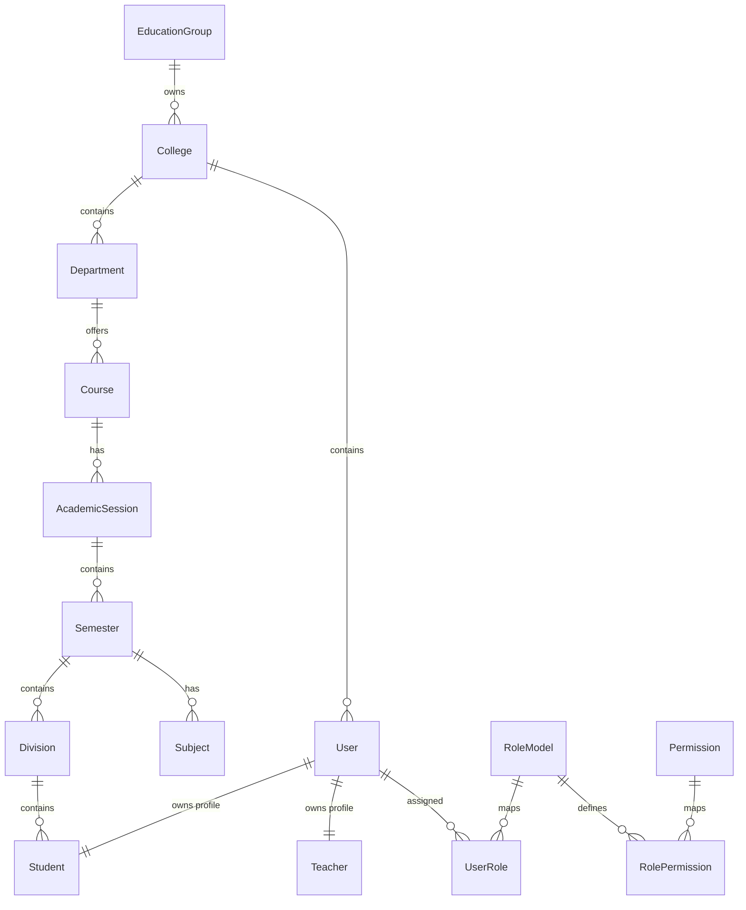

# Campus Connect Database Architecture & Standards

**Version**: 1.0  
**Centralized multi-tenant PostgreSQL database with multi-college support**

---

## 1. Relational Entity Hierarchy



---

## 2. Database Design Principles

*   **Rule 1: No Data Redundancy**  
    Never duplicate data across columns. Reference entities using foreign keys instead of replicating string fields.
    *   *Incorrect*: Storing `course_name` directly in `students` table.
    *   *Correct*: Store `course_id` (foreign key) linking to the `courses` table.
*   **Rule 2: Uniform Primary Keys (UUID)**  
    All tables must use UUIDs for their primary keys (`id UUID PRIMARY KEY`). Integer/Serial auto-incrementing IDs are strictly prohibited.
*   **Rule 3: Audit Columns**  
    Every table must include standard tracking metadata:
    *   `id` (UUID)
    *   `created_at` (TIMESTAMP)
    *   `updated_at` (TIMESTAMP)
    *   `deleted_at` (TIMESTAMP NULL)
*   **Rule 4: Soft Delete Standard**  
    Data deletion must always be soft-deleted. No raw `DELETE FROM` statements are allowed. Implement soft delete by updating the `deleted_at` column to the current timestamp.

---

## 3. Database Naming Conventions

*   **Tables**: plural, `snake_case` (e.g., `attendance_records`, `student_documents`, `teacher_subjects`).
*   **Columns**: singular, `snake_case` (e.g., `created_at`, `student_id`, `department_id`).

---

## 4. Standard Columns Schema

Every database table is expected to inherit the following base structural fields:

| Column | Type | Description |
| :--- | :--- | :--- |
| `id` | UUID | Primary Key |
| `created_at` | TIMESTAMP | Creation Timestamp (defaults to `NOW()`) |
| `updated_at` | TIMESTAMP | Auto-updating modification timestamp |
| `deleted_at` | TIMESTAMP NULL | Null unless the record is soft-deleted |

---

## 5. Relationships

*   **One-to-One**: e.g., `User` $\rightarrow$ `Student` / `Teacher` (One system user credentials record maps to exactly one profile entity).
*   **One-to-Many**: e.g., `Department` $\rightarrow$ `Courses` (One department hosts multiple courses).
*   **Many-to-Many**: e.g., `Teacher` $\leftrightarrow$ `Subject` (Implemented via join tables, e.g., `teacher_subjects` or `RolePermission`).

---

## 6. Schema Layer Structure

The database is conceptually partitioned into 9 layers:

```
[Authentication] ➔ [Organization] ➔ [Academic] ➔ [Teaching] ➔ [Student] ➔ [Learning] ➔ [Communication] ➔ [Analytics] ➔ [System]
```

### Layer Reference

1.  **Authentication Layer**: Handles access and security only. Stores no academic information.
    *   *Tables*: `users`, `roles`, `permissions`, `user_roles`, `role_permissions`, `sessions`, `refresh_tokens`, `login_history`, `password_reset_tokens`.
2.  **Organization Layer**: Manages multi-college routing.
    *   *Tables*: `education_groups`, `colleges`, `college_settings`.
3.  **Academic Layer**: Holds the structural core of academic schedules and syllabi.
    *   *Tables*: `departments`, `courses`, `academic_sessions`, `semesters`, `divisions`, `subjects`.
4.  **Teaching Layer**: Handles teacher workload assignments.
    *   *Tables*: `teachers`, `teacher_subjects`, `teacher_activity`, `timetable`, `attendance`.
5.  **Student Layer**: Manages profile records and parent relationships.
    *   *Tables*: `students`, `student_guardians`, `student_documents`, `student_activity`.
6.  **Learning Layer**: Stores educational material and tasks.
    *   *Tables*: `notes`, `note_files`, `note_views`, `note_downloads`, `assignments`, `assignment_submissions`.
7.  **Communication Layer**: Tracks notifications, events, and feeds.
    *   *Tables*: `events`, `event_participants`, `announcements`, `notifications`.
8.  **Analytics Layer**: Aggregates reporting metrics.
    *   *Tables*: `dashboard_statistics`, `generated_reports`.
9.  **System Layer**: General log files and background management resources.
    *   *Tables*: `audit_logs`, `backups`, `files`, `system_settings`.

---

## 7. Indexing Standards

To maintain high query speeds, indices must be built on the following fields:

*   **Unique Attributes**: `email`, `roll_number`, `employee_id`, `course_code`, `subject_code`, `department_code`.
*   **Foreign Keys**: `student_id`, `teacher_id`, `college_id`, `department_id`, `subject_id`.
*   **DateTime Coordinates**: `created_at`, `event_date`.
*   **Composite Filters**: Multi-column indices (e.g., `(college_id, department_id)`) for heavy dashboard reporting operations.

---

## 8. Multi-College Isolation

To secure tenant information:
*   Every query executed in the context of a college must automatically filter by the tenant identifier (`college_id`).
*   Direct access to other college databases is prohibited unless authorized at the global level.

---

## 9. Performance & Security Best Practices

1.  **Strict Transaction Boundaries**: Operations involving multi-step inserts (e.g., creating a student profile, creating credentials, assigning roles, generating a student code, sending notifications, and audit logging) must be wrapped inside a database transaction (`BEGIN` / `COMMIT` / `ROLLBACK`) to prevent orphaned datasets.
2.  **No Binary Data**: Large files are stored on cloud storage (AWS S3 or Cloudinary). The database holds only absolute URL path links (`file_url`).
3.  **Historical Integrity**: Changes to critical entities are tracked inside history tables (`student_history`, `teacher_history`, `attendance_history`, `timetable_history`, `subject_history`).
4.  **Credential Protection**: All passwords must be hashed securely using standard stretching algorithms (`bcrypt` or `Argon2`). Plain-text password storage is completely prohibited.

---

## 10. Authentication Database Architecture (Version 1.0)

### 10.1 Purpose
The Authentication module is responsible for: Login, Logout, User Accounts, Sessions, Password Security, Roles, Permissions, Refresh Tokens, Login History, Password Reset, Multi-Device Login, Account Lock, and Security Audit. It never stores academic data.

### 10.2 Database Tables (Total: 12 Tables)
1.  **`users`**: Stores login credentials, status, must-change-password flag, failed attempts count, and lock duration timestamps.
2.  **`user_profiles`**: Stores user-specific name details, phone, address, and profile photo.
3.  **`roles`** (`role_models`): Stores roles (e.g. `COLLEGE_ADMIN`, `TEACHER`, `STUDENT`).
4.  **`permissions`**: Stores specific capabilities (e.g., `students.create`, `courses.update`).
5.  **`user_roles`**: Maps users to one or more roles.
6.  **`role_permissions`**: Maps roles to specific permission capabilities.
7.  **`sessions`**: Active logins tracking (stores token, IP address, user-agent/browser/OS, geo-location, and expiration status).
8.  **`refresh_tokens`**: Revocable refresh token hashes for security.
9.  **`login_history`**: Audit trail of all login actions (failed, successful, lockout triggers).
10. **`password_reset_tokens`**: Active password recovery tokens.
11. **`otp_codes`**: Temporary 6-digit one-time codes for verification/reset.
12. **`devices`**: Trusted/registered devices list.

### 10.3 Core Business Rules
*   **Account Lockout**: After 5 consecutive failed login attempts, block access for 15 minutes. Record block time in `locked_until` and log audit events.
*   **Active Sessions**: Users can list, audit, and revoke individual active sessions from their settings. Revoking deactivates tokens in `sessions` and `refresh_tokens`.
*   **OTP Expiry**: Password reset/verification OTP codes are valid for a maximum of 15 minutes, are single-use, and must be stored securely with hashes.

