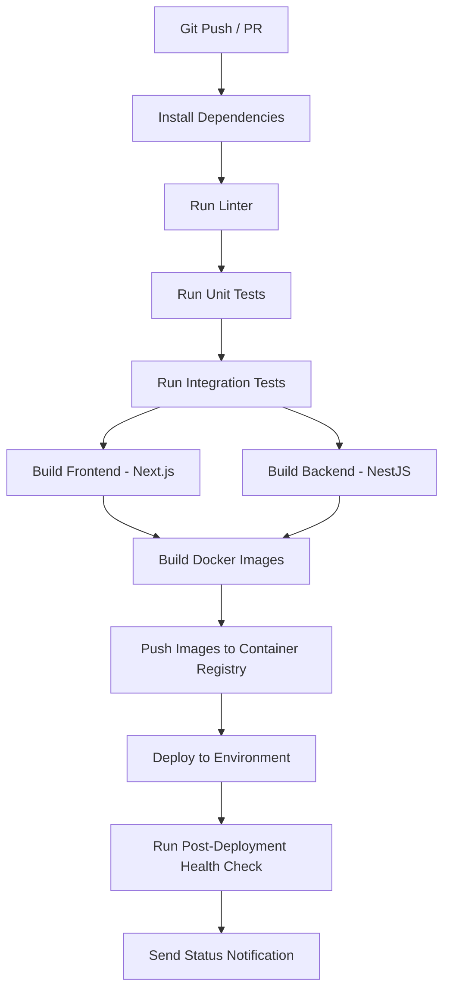
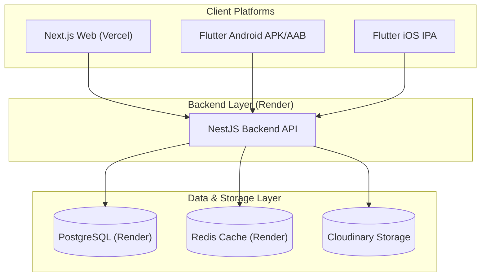

# Campus Connect Deployment & CI/CD Specification

**Version**: 1.0  
**CI/CD Pipeline & Deployment Strategy Standards**

---

## 1. Objective
Automate the testing, build execution, image packaging, and deployment orchestration for every code modification introduced to the Campus Connect repository, ensuring zero-downtime rollouts and high software quality.

---

## 2. Git Branch Strategy
A strict branch protection and merge policy is enforced to govern release quality:

```
[feature/* or hotfix/*] ───(Pull Request / Review)───> [develop] ───(Staged / Merge)───> [main]
```

*   **`main` (Production)**: Holds stable, production-ready code. Direct commits are blocked. Changes are only merged from `develop` via formal pull requests. Releases are tagged (e.g. `v1.0.0`).
*   **`develop` (Development)**: Integration branch for new features and non-breaking updates. Serves as the source branch for the Staging environment.
*   **`feature/*` (Features)**: Short-lived branches spawned from `develop`. Merged back to `develop` via pull requests after manual review and pipeline validation.
*   **`hotfix/*` (Critical Fixes)**: Spawned directly from `main` to address production bugs. Merged back to both `main` and `develop` after testing.

---

## 3. CI/CD Pipeline Flow

The GitHub Actions workflow automates verification from code commit to cloud deployment:



1.  **Git Push / PR Trigger**: Executes the pipeline on push to `develop` or `main`, or on creation of a Pull Request.
2.  **Install Dependencies**: Installs workspace packages using `pnpm` with frozen lockfile validation.
3.  **Run Linter**: Validates code styling, TS rules, and syntax structures.
4.  **Run Unit Tests**: Executes unit test suites (`jest`).
5.  **Run Integration Tests**: Executes database/API integration tests.
6.  **Build Codebases**: Compiles NestJS backend and builds Next.js frontend production bundles.
7.  **Build Docker Images**: Constructs multi-stage Docker containers for `api` and `web`.
8.  **Push Images**: Pushes the compiled Docker images to the Container Registry (e.g. AWS ECR or Docker Hub) tagged with the commit SHA and environment tags.
9.  **Deploy**: Deploys the images to target servers (ECS, Kubernetes, or Docker Compose-driven hosts).
10. **Health Check**: Executes automatic endpoints checking to verify application online state.
11. **Notifications**: Sends execution summaries to DevOps channels.

---

## 4. Deployment Environments

| Environment | Trigger Mechanism | Target Branch | Deployment Strategy |
| :--- | :--- | :--- | :--- |
| **Development** | Automated push | `develop` | Continuous Deployment (Auto-deploy on pipeline success) |
| **Staging** | Automated pipeline | `develop` / release tags | Manual Approval (Gated behind QA confirmation) |
| **Production** | Release creation / tag | `main` | Protected Deployment (Required dual signatures, zero-downtime rolling update) |

---

## 5. Rollback Strategy

If a deployment fails validation or health checks:

```
[Deployment Fails Check] ➔ [Stop Rollout] ➔ [Fetch Last Healthy Docker Image] ➔ [Redeploy Image] ➔ [Re-run Health Check] ➔ [Notify Engineers]
```

1.  **Halt Deployment**: Immediately stop the active update rollout.
2.  **Pull Previous Image**: Retrieve the last known stable Docker image tag from the registry.
3.  **Redeploy Services**: Force update services to run the previous stable version.
4.  **Verify Restoration**: Execute health verification checks on the rolled-back instances.
5.  **Notify Team**: Broadcast critical alerts with error logs to the Discord/Slack channels and email list.

---

## 6. Post-Deployment Verification Check
After any deployment, the verification engine must automatically poll and validate the health of all infrastructure interfaces:

*   **Frontend**: `GET /` returns status code `200` with the correct meta tags.
*   **Backend API**: `GET /api/health` returns status code `200` with API health status.
*   **Database**: `GET /api/health/database` returns PostgreSQL connection as `CONNECTED`.
*   **Redis Cache**: `GET /api/health/redis` returns Redis connection as `CONNECTED`.
*   **Storage**: `GET /api/health/storage` returns Cloud Storage access as `CONNECTED`.
*   **SMTP Service**: Verification handshake with SMTP relay to confirm mail transport is open.
*   **Socket.IO Server**: `GET /api/health/socket` returns WebSocket server connection as `CONNECTED`.

---

## 7. Status Notifications
Build and deployment telemetry summaries are dispatched automatically.
*   **Data Fields Included**:
    *   Build Status (SUCCESS / FAILED)
    *   Target Environment (Development / Staging / Production)
    *   Deployment Time & Duration
    *   Version / Release Tag
    *   Git Commit ID & Author Name
    *   Logs link for quick troubleshooting
*   **Channels**:
    *   Email (Primary)
    *   Slack / Discord webhooks (Future Support)

---

## 8. Secrets Management
Under no circumstances should secrets, API keys, or credentials be committed to repository control.

*   **Local Development**: Stored in a git-ignored `.env` file in root and application folders.
*   **Production/Staging**: Injected at runtime via environment variables from security stores (e.g. AWS Secrets Manager or GitHub Secrets).
*   **Secret Register Checklist**:
    *   `DATABASE_URL`: PostgreSQL connection string.
    *   `JWT_SECRET` & `JWT_REFRESH_SECRET`: Encryption keys.
    *   `SMTP_PASSWORD`: Credentials for outbound mail server.
    *   `REDIS_PASSWORD`: Access credentials for cache node.
    *   `CLOUDINARY_URL` / `AWS_ACCESS_KEY_ID` & `AWS_SECRET_ACCESS_KEY`: Storage keys.
    *   `API_KEYS`: External vendor authorization credentials.

---

## 9. Production Release Checklist
Before running the deployment script for a new production release, the release manager must check off the following prerequisites:

*   [ ] **All Tests Pass**: Unit and integration test coverage meets minimum target threshold.
*   [ ] **Build Success**: Frontend and Backend code compiles without warnings.
*   [ ] **Docker Images Built**: Containers are packaged and verified with tag matches.
*   [ ] **Database Migrations Ready**: Production schema migration scripts have been dry-run and are ready to execute.
*   [ ] **Environment Variables Verified**: Configuration keys on target server are updated to match release parameters.
*   [ ] **Health Checks Passed**: Staging validation confirms all integration layers function properly.
*   [ ] **Monitoring Enabled**: APM triggers, alerts, and metrics collections are operational.
*   [ ] **Backup Completed**: Full backup of PostgreSQL database and file storage metadata executed.
*   [ ] **Rollback Plan Verified**: Previous stable docker tag is accessible in the registry for instant restore.

---

## 10. Monitoring & Logging Specification

### 10.1 Objective
Maintain comprehensive real-time visibility into application performance, server health, system errors, user audits, and resource utilization to identify anomalies, prevent downtime, and sustain security compliance.

### 10.2 Monitoring Architecture

```
[User Request] ➔ [Nginx] ➔ [Backend API] ➔ [PostgreSQL / Redis / Cloud Storage]
                                  │
                                  ▼
                         [Monitoring Agent]
                                  │
                                  ▼
                         [Grafana Dashboard] ➔ [Alerts (Slack/PagerDuty/Email)]
```

### 10.3 Infrastructure Monitoring
Polls resources every **30 seconds** to track server health:
*   **CPU Utilization**: Detect high compute loads or runaway processes.
*   **Memory Usage (RAM)**: Trace memory leak indicators.
*   **Disk Capacity**: Ensure active storage does not run out of space.
*   **Disk IOPS**: Track file system read/write operation rates.
*   **Network & Bandwidth**: Monitor ingress and egress rates.
*   **System Load Average**: Keep track of task queues.
*   **Uptime**: Monitor long-term system stability.

### 10.4 Application & Database Monitoring
Tracks metrics related to request lifecycles and backend operations:
*   **Application Metrics**: API request count, average latency/response time, active sessions, failed request volumes, authentication error rates, and cron/queue execution performance.
*   **Database Metrics**: Total size on disk, active connections, slow queries (execution time > 500ms), deadlocks, index utilization, and backup execution status.
*   **Cache Metrics (Redis)**: Memory utilization, cache hit/miss ratio, key eviction frequency, active client connections, and commands executed per second.
*   **Real-Time Sockets (Socket.IO)**: Concurrent users, active channel rooms, message rates, socket reconnect occurrences, and socket disconnection rates.

### 10.5 Log Categories & Retention

Logs are written in structured JSON and cataloged into four distinct domains:

| Log Category | Contents | Retention Period |
| :--- | :--- | :--- |
| **Application Logs** | API request/response payloads, business workflows, cron executions. | 30 Days |
| **Access Logs** | Nginx request headers, incoming IP addresses, client agents, and route paths. | 90 Days |
| **Error & System Logs** | Stack traces, database exceptions, service failures, Docker events. | 180 Days |
| **Audit Logs** | User creation, role modifications, grade/attendance updates, deletion actions. | 365 Days |

#### 10.6 Log Severity Levels
*   `CRITICAL`: System-wide failure (e.g. database down, memory exhausted). Requires immediate developer page.
*   `ERROR`: Local operation failure (e.g. email delivery failed, payment fail). Requires investigation.
*   `WARNING`: Anomalous events (e.g. slow query, request rate nearing threshold).
*   `INFO`: Normal business events (e.g. successful login, user updated).
*   `DEBUG`: Highly verbose step-by-step trace logs (Development env only).

### 10.7 Alert & Notification Rules
The monitoring system triggers automated alerts to the engineering on-call channel under the following conditions:

```
[Server Offline] ➔ CRITICAL Alert
[Database / Redis Offline] ➔ CRITICAL Alert
[API Error Rate > 5% for 2 mins] ➔ CRITICAL Alert
[CPU / RAM Usage > 90%] ➔ WARNING Alert
[Disk Space > 85%] ➔ WARNING Alert (Grows to CRITICAL at 90%)
[Database Backup Execution Failed] ➔ ERROR Alert
[SSL/TLS Certificate Expiring < 14 Days] ➔ WARNING Alert
```

### 10.8 Health Status Dashboard
A centralized Grafana/Kibana UI aggregates live metrics to showcase:
*   Node online statuses (Nginx, Backend API, PostgreSQL, Redis, Cloud Storage, SMTP relay, Socket.IO gateway).
*   API latency heatmap.
*   Daily active users (DAU) and database size growth rates.

---

## 11. Backup & Disaster Recovery Specification

### 11.1 Objective
Ensure complete security of institutional data against hardware failures, software anomalies, human errors, cyber threats, and catastrophic environment events.

### 11.2 Backup Flow

```
[PostgreSQL DB] ➔ [Nightly SQL Dump] ➔ [Gzip Compression] ➔ [AES-256 Encryption] ➔ [Cloud Object Storage]
                                                                                           │
                                                                                           ▼
                                                                                   [Integrity Check]
```

### 11.3 Backup Types & Intervals
Backups are structured hierarchically:
*   **Daily Backups**: Automated export of the PostgreSQL database, media uploads, and server logs.
*   **Weekly Backups**: Comprehensive export including databases, media uploads, configuration keys, and env setups.
*   **Monthly Backups**: Full system state snaps for long-term auditing archives.

### 11.4 Backup Schedule
All automated backup crons run during low-traffic windows:

| Backup Entity | Run Schedule | Frequency |
| :--- | :--- | :--- |
| **PostgreSQL Database** | 02:00 AM Every Day | Daily |
| **Media Uploads Bucket** | 03:00 AM Every Day | Daily |
| **Application & Server Logs** | 04:00 AM Every Day | Daily |
| **System State Snapshot** | 01:00 AM Sunday | Weekly |

---

### 11.5 Retention Policy
Backups are rotated based on age:
*   **Daily Backups**: Retained for **30 Days**.
*   **Weekly Backups**: Retained for **12 Weeks**.
*   **Monthly Backups**: Retained for **12 Months**.
*   **Yearly Backups**: Retained for **5 Years** (archived to low-cost Glacier cold storage).

### 11.6 Encryption & Validation
*   **Encryption**: Backups must be encrypted in transit and at rest using the **AES-256** standard before uploading.
*   **Validation**: Every upload is verified by checking the MD5 cryptographic checksum against the database record. An automated script tests the restoration of the database dump in an isolated sandbox environment once a week.

### 11.7 Restore Workflow
In the event of database corruption or data loss:

```
[Select Target Backup Tag] ➔ [Verify Cryptographic Checksum] ➔ [Restore Database Schema & Data] ➔ [Restore Media Files] ➔ [Re-apply Config Envs] ➔ [Restart Services] ➔ [Run Verification Health Checks]
```

---

### 11.8 Recovery SLA Targets
*   **Recovery Time Objective (RTO)**: Total time to restore services must be **< 30 minutes**.
*   **Recovery Point Objective (RPO)**: Maximum acceptable data loss duration must be **< 24 hours** (aiming for `< 1 hour` in future replication stages).

### 11.9 Backup Alerts
Immediate critical notifications are triggered if:
*   An automated backup dump process fails.
*   An upload to Cloud Storage fails or times out.
*   Cloud Storage bucket capacity exceeds 85%.
*   Cryptographic validation checks or restoration tests fail.

---

## 12. Production Maintenance & Operations Specification

### 12.1 Objective
Maintain server performance, application stability, and package security through scheduled recurring maintenance procedures.

### 12.2 Operations Timetable

#### 12.2.1 Daily Actions
*   Verify health of Nginx, Backend API, PostgreSQL, Redis, Cloud Storage, SMTP mail relay, and Socket.IO gateways.
*   Check for active cron failures and verify background queue job states.

#### 12.2.2 Weekly Actions
*   Perform database query analysis and run database table index optimization.
*   Flush expired Redis cache keys.
*   Rotate and archive system log files.
*   Prune orphan uploads (temporary uploads older than 24 hours).
*   Perform dependency scanning for security vulnerabilities.

#### 12.2.3 Monthly Actions
*   Execute a dry-run restoration test from database backup files to verify RTO/RPO limits.
*   Perform system load and performance audits.
*   Review infrastructure capacity limits (disk space, RAM, network bandwidth thresholds).

---

### 12.3 Database Maintenance Commands
Prisma developers and DBAs must run these routine operations during maintenance windows:
*   `VACUUM`: Clear soft-deleted records and reclaim database storage space.
*   `ANALYZE`: Update query execution stats to ensure optimizer uses faster execution paths.
*   `REINDEX`: Re-build index paths to speed up slow queries.

### 12.4 Incident Severity & Mitigation
Operations incidents are assigned severity grades to determine response SLAs:

| Severity Level | Definition | Response SLA | Mitigation Action |
| :--- | :--- | :--- | :--- |
| **Critical** | Global system outage (e.g. database down, API offline). | < 15 Minutes | Failover trigger, rolling restart, rollback. |
| **High** | Major module failure (e.g. login broken, uploads fail). | < 30 Minutes | Deployment hotfix, service isolation. |
| **Medium** | Partial feature bug (e.g. export delay, minor styling bug). | < 4 Hours | Standard hotfix PR, queue clearing. |
| **Low** | Minor anomaly (e.g. spelling error, log warning). | < 24 Hours | Queue in next release cycle. |

---

### 12.5 Change Management Guidelines
No modifications are deployed directly to the production environment without passing the change protocol:
1.  **Peer Review**: Code change requires approval from at least one senior engineer.
2.  **Staging Approval**: Validated on staging server under load conditions.
3.  **Backup**: Trigger a manual database snapshot before deployment.
4.  **Deployment & Check**: Deploy via zero-downtime rolling update and run health endpoint checks.
5.  **Rollback Plan**: Verify rollback container image is ready to run in the registry.

---

## 13. Production Readiness Checklist

Before final deployment of the Campus Connect ERP to the production cloud, all items on this checklist must be verified:

### 13.1 Infrastructure
*   [ ] **HTTPS Enabled**: SSL/TLS certificate installed and auto-renewals configured.
*   [ ] **Firewall Configured**: Ports restricted (only 80, 443, and 22 open publicly).
*   [ ] **Cloudflare Active**: DDoS protections, Web Application Firewall (WAF), and DNS routes verified.

### 13.2 Application
*   [ ] **Services Running**: Next.js frontend and NestJS backend instances running stably.
*   [ ] **Socket.IO Gateway Connected**: WebSocket adapters running with multi-node sticky sessions.
*   [ ] **Cron Jobs Active**: Background tasks scheduled and monitored.

### 13.3 Database & Cache
*   [ ] **PostgreSQL Connected**: Prisma client connected and migrations fully applied.
*   [ ] **Database Indices Verified**: All primary search fields indexed to prevent slow queries.
*   [ ] **Backups Scheduled**: Automated cron scripts for daily backups active and verified.
*   [ ] **Redis Active**: Caching nodes running and cache-warming actions configured.

### 13.4 Storage & Security
*   [ ] **Cloud Storage Active**: Cloudinary and AWS S3 connections verified.
*   [ ] **Signed URLs Active**: Expiry targets set to 15 minutes for private documents.
*   [ ] **Input Validation Active**: Helmet headers, CORS policies, and NestJS `ValidationPipe` active.
*   [ ] **Secrets Secured**: All application secrets managed via encrypted vault injects.

### 13.5 Monitoring & CI/CD
*   [ ] **Metrics Dashboard Active**: Grafana dashboard reporting CPU, RAM, and database limits.
*   [ ] **Alert Rules Configured**: Outage warnings and backup error alerts linked to email/messaging channels.
*   [ ] **CI/CD Pipelines Operational**: GitHub Actions tests passing and rollback scripts verified.

---

## 14. Production Architecture & Deliverables

The production ecosystem encompasses Next.js web application, NestJS API service, and Flutter mobile applications.

### 14.1 Production Architecture Topology


### 14.2 Production Deliverables & Build Targets

#### Next.js Web
*   **Target**: Static & SSR Web builds
*   **Host**: Vercel
*   **Production URL**: `https://college.yourdomain.com`

#### NestJS Backend API
*   **Target**: Node.js compilation container
*   **Host**: Render
*   **Production URL**: `https://api.college.yourdomain.com`

#### Android Mobile Release
*   **Target**: Signed Release APK & Google Play App Bundle (AAB)
*   **Build Commands**:
    ```bash
    flutter build apk --release
    flutter build appbundle --release
    ```
*   **Outputs**:
    *   `build/app/outputs/flutter-apk/app-release.apk`
    *   `build/app/outputs/bundle/release/app-release.aab`

#### iOS Mobile Release (Future support)
*   **Target**: Signed iOS App Archive (IPA)
*   **Build Command**:
    ```bash
    flutter build ipa --release
    ```
*   **Output**:
    *   `build/ios/ipa/CampusConnect.ipa`

### 14.3 Production Directory Structure
All production artifacts and configurations are compiled into a unified layout:
```
Production/
├── backend/                  # Compiled NestJS production bundle
├── frontend/                 # Optimized Next.js server/static files
├── mobile/                   # Mobile release binaries
│   ├── android/
│   │   ├── apk/
│   │   │   └── CampusConnect-v1.0.0.apk
│   │   └── aab/
│   │       └── CampusConnect-v1.0.0.aab
│   └── ios/
│       └── CampusConnect-v1.0.0.ipa
├── deployment/               # Cloud configurations (Render yaml, Vercel config)
├── docker/                   # Docker Compose configurations
└── docs/                     # Release logs and manual guides
```

---

## 15. Mobile Platform Releases (Flutter)

Mobile platform pipelines are segregated to support fast verification, code analysis, and compilation.

### 15.1 Android Release Pipeline
```
[Flutter Source] ➔ [flutter pub get] ➔ [flutter analyze] ➔ [flutter test] ➔ [flutter build apk --release] ➔ [flutter build appbundle --release] ➔ [Binaries Generated]
```

### 15.2 iOS Release Pipeline
```
[Flutter Source] ➔ [flutter pub get] ➔ [flutter analyze] ➔ [flutter test] ➔ [flutter build ipa --release] ➔ [IPA Binary Generated]
```

### 15.3 App Signing & Versioning Specifications
*   **Version Name**: `1.0.0`
*   **Version Code**: `1`
*   **Android Signing**: Local keystore mapping configured via `android/key.properties` for production. Managed Google Play App Signing is utilized for store distribution.
*   **iOS Signing**: Apple Distribution Certificate linked with an App Store Provisioning Profile.

---

## 16. Future CI/CD Pipeline (Flutter Release Automation)

To support fully automated releases on every production tag push:

```mermaid
flowchart TD
    A[Git Push / Tag] --> B[Run Backend Tests]
    A --> C[Run Frontend Tests]
    A --> D[Run Flutter Mobile Tests]
    
    B & C & D --> E[Build API & Deploy to Render]
    B & C & D --> F[Build Web & Deploy to Vercel]
    
    B & C & D --> G[Build Flutter APK/AAB (Ubuntu runner)]
    B & C & D --> H[Build Flutter IPA (macOS runner)]
    
    G & H --> I[Upload Release Artifacts]
    I --> J[Generate GitHub Release with binaries]
    J --> K[Deploy AAB/IPA to Test Channels]
```

### 16.1 Automated GitHub Actions CI/CD Flow
1.  **Release Trigger**: Workflow starts on new tag push (e.g. `v*.*.*`) or direct PR approvals to `main`.
2.  **Platform Jobs**:
    *   **Backend / Frontend**: Lint, Test, Deploy (Render & Vercel).
    *   **Android Release Job**: Sets up Java 17 and Flutter SDK, runs `flutter build apk --release` and `flutter build appbundle --release`, then uploads them.
    *   **iOS Release Job (macOS-latest)**: Sets up Xcode certificates, CocoaPods, and Flutter SDK, runs `flutter build ipa --release`, then uploads the IPA.
3.  **GitHub Release Integration**: The outputs are automatically published directly to a GitHub Release, making the latest APK instantly downloadable for testing.
4.  **Beta Track Distribution (Optional)**: Automatically forward the `.aab` to Google Play Console Internal Testing track and `.ipa` to Apple TestFlight.
